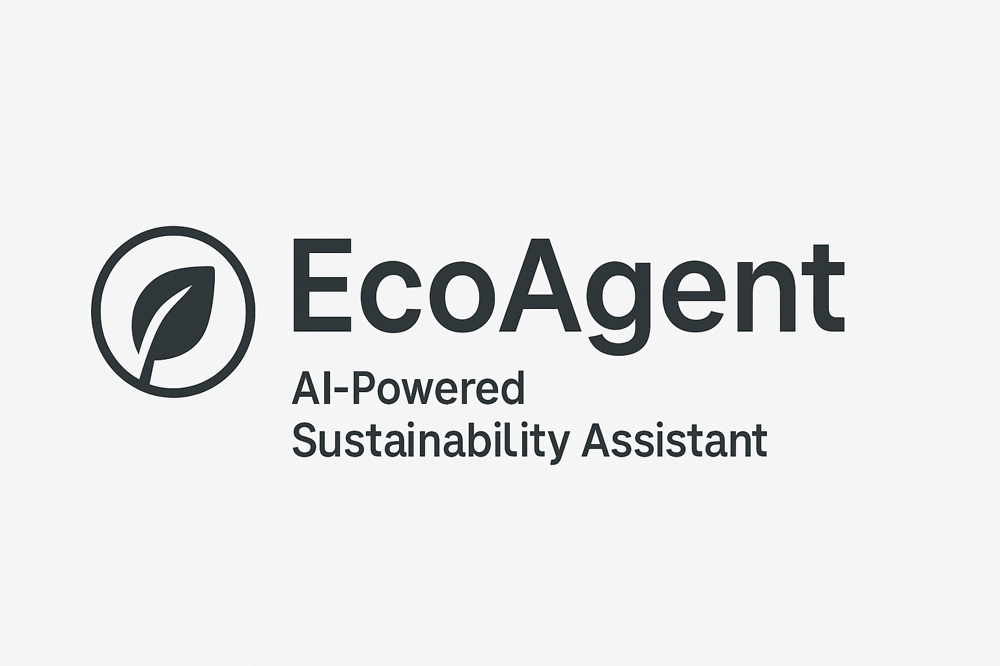

# EcoAgent: Multi-Platform Sustainability Assistant

[](resources/ecoagent.png)

EcoAgent is a comprehensive sustainability assistant that provides powerful environmental tools through multiple platforms: Model Context Protocol (MCP) server and OpenAI ChatGPT integration. Built on top of the EcoAgent sustainability assistant, it allows AI agents to access carbon footprint calculations, personalized environmental recommendations, and real-time environmental data.

## MCP Track: Building MCP (Consumer Category)

**Category**: Building MCP - Consumer Track
**Tag**: `building-mcp-track-consumer`

Full MCP-compliant server with 13 sustainability-focused tools for consumer use.

### MCP Features

-   **Full MCP Protocol Compliance**: Implements all MCP protocol requirements with proper tool discovery and execution
-   **Standardized Tool Schemas**: Each tool follows JSON Schema specification for proper parameter validation
-   **Carbon Footprint Tools**: Transportation, flight, home energy, and aggregate calculations
-   **Sustainability Recommendations**: Personalized advice for transportation, energy, and diet
-   **Environmental Information Access**: Real-time search and local resource discovery
-   **MCP Client Integration**: Works with Claude Desktop, Cursor, and other MCP-compatible tools

## OpenAI - ChatGPT App & API Integration

**Category**: OpenAI Integration Track
**Target**: Best ChatGPT App & Best API Integration

### OpenAI Best Practices Implementation

-   **Well-Scoped Capabilities**: Focused on specific sustainability jobs-to-be-done
-   **NEW THINGS TO KNOW**: Real-time carbon calculations, environmental data access
-   **NEW THINGS TO DO**: Sustainability recommendations, unit conversions
-   **BETTER WAYS TO SHOW**: Structured environmental impact data and metrics
-   **Immediate Value**: Quick, relevant responses on first interaction
-   **Privacy by Design**: Minimal required parameters, no unnecessary context
-   **Ecosystem Ready**: Outputs designed for chaining with other tools

## Multi-Platform Features

### MCP Protocol Implementation

-   `transportation_carbon` - Calculate vehicle emissions
-   `flight_carbon` - Calculate flight emissions
-   `home_energy_carbon` - Calculate home energy emissions
-   `total_carbon` - Aggregate carbon from multiple sources
-   `suggest_transportation_alternatives` - Recommend green transport
-   `suggest_energy_efficiency_improvements` - Home energy tips
-   `suggest_dietary_changes` - Eco diet recommendations
-   `search_environmental_info` - Environmental search
-   `get_local_environmental_resources` - Local sustainability resources
-   `get_latest_environmental_news` - Environmental news
-   `get_sustainability_practice_info` - Practice details
-   `convert_units_with_context` - Unit conversions

### OpenAI ChatGPT Integration

-   Function calling for all 13 sustainability tools
-   Conversational interface for environmental questions
-   Context-aware recommendations
-   Real-time carbon footprint calculations
-   Professional Gradio interface

## Architecture

The EcoAgent platform implements both MCP protocol and OpenAI API integration:

-   **MCP Server**: Full MCP compliance with standardized tool discovery and execution
-   **OpenAI Integration**: GPT-4o with function calling for sustainability tools
-   **Multi-Agent System**: Hierarchical agents for different sustainability aspects
-   **Dual Interface**: MCP server and ChatGPT app from same codebase
-   **Unified Tools**: Same 13 sustainability tools available via both interfaces

## Requirements

-   Python 3.9+
-   OpenAI API Key (for ChatGPT integration)
-   Google API Key (for extended Gemini features)
-   Gradio with MCP support
-   [uv](https://github.com/astral-sh/uv) (recommended package manager)

## Quick Start

### Installation

```bash
# Clone the repository
git clone https://github.com/vinhnx/ecoagent.git
cd ecoagent

# Install uv (if not already installed)
curl -LsSf https://astral.sh/uv/install.sh | sh

# Set up environment and install dependencies
uv venv
source .venv/bin/activate  # On Windows: .venv\Scripts\activate
uv pip install -e .

# Configure API keys
export OPENAI_API_KEY='your-openai-api-key'      # Required for ChatGPT
export GOOGLE_API_KEY='your-gemini-api-key'      # Optional for advanced features
```

### Running the MCP Server

```bash
# Run the MCP server
uv run python -m ecoagent.mcp_server
```

The MCP server will be available at:

-   Web Interface: http://localhost:8000
-   MCP Endpoint: http://localhost:8000/gradio_api/mcp/sse

### Running the ChatGPT App

```bash
# Run the ChatGPT app
uv run python -m chatgpt_app
```

The ChatGPT app will be available at:

-   Web Interface: http://localhost:7860

## Configuration

Create a `.env` file in the root directory:

```env
# Required: Your OpenAI API key for ChatGPT integration
OPENAI_API_KEY=your_openai_api_key

# Optional: Your Google API key for extended features
GOOGLE_API_KEY=your_api_key_here

# Optional: Other settings
ECOAGENT_ENVIRONMENT=development
LOG_LEVEL=INFO

# Optional: Gemini Google Search grounding (enabled by default)
ECOAGENT_ENABLE_GOOGLE_SEARCH=true
```

## Platform Integration

### MCP Client Integration

Configure MCP clients with the endpoint: `http://localhost:8000/gradio_api/mcp/sse`

### OpenAI ChatGPT Integration

The ChatGPT app provides a conversational interface with 13 sustainability tools accessible through function calling.

## Example Use Cases

### For MCP-Compatible AI Agents (Claude Desktop, Cursor, etc.)

-   Calculate user carbon footprints during conversations using MCP protocol
-   Provide personalized sustainability recommendations via standardized tools
-   Access real-time environmental data through MCP tool calls

### For ChatGPT Integration

-   Natural language queries about sustainability
-   Conversational carbon footprint analysis
-   Context-aware environmental recommendations
-   Real-time tool usage through function calling

### For Developers

-   Integrate sustainability features via MCP protocol
-   Use ChatGPT-style interface for direct user interaction
-   Build sustainability workflows using either approach

## OpenAI Alignment

### Best ChatGPT App

-   [x] ChatGPT-style conversation interface
-   [x] Professional Gradio user interface
-   [x] Real-time sustainability assistance
-   [x] 13 specialized environmental tools
-   [x] Context-aware recommendations

### Best API Integration

-   [x] OpenAI API integration with GPT-4o
-   [x] Function calling for sustainability tools
-   [x] Proper API error handling
-   [x] Asynchronous API calls
-   [x] Professional OpenAI integration

## Contributing

We welcome contributions to enhance the EcoAgent platform! Please follow these steps:

1. Fork the repository
2. Create a feature branch
3. Make your changes
4. Add tests if applicable
5. Submit a pull request

## License

This project is licensed under the Apache 2.0 License - see [LICENSE](LICENSE) for details.

## Acknowledgments

-   Built with Google's Agent Development Kit (ADK)
-   Powered by OpenAI API for ChatGPT integration
-   Gradio MCP support for seamless protocol integration
-   MCP Protocol specification compliance
-   Inspired by the need for sustainable AI practices

[Demo Screenshot](resources/demo.png)

---

**Made with love for the environment**

_EcoAgent - Empowering AI agents and users to make sustainability accessible through MCP and ChatGPT integration_
